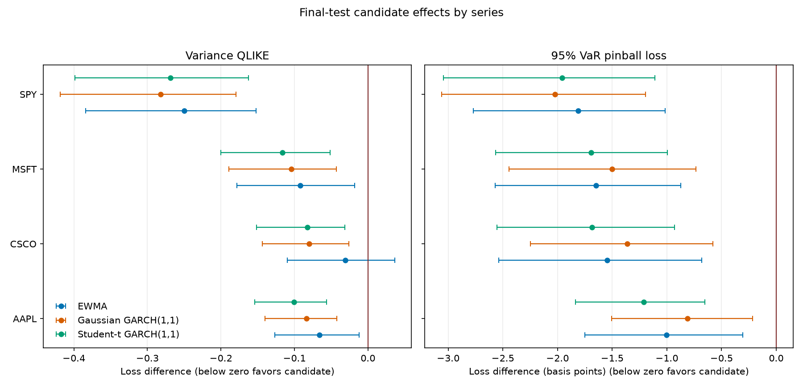

# Market Risk Forecasting Engine

[](https://github.com/SIRE02/market-risk-forecasting-engine/actions/workflows/ci.yml)
[](https://www.python.org/downloads/)
[](LICENSE)

A reproducible Python research tool for one-session-ahead variance and Value at
Risk (VaR) forecasting. It compares transparent historical benchmarks with
EWMA, Gaussian GARCH(1,1), and Student-t GARCH(1,1), evaluates the forecasts,
and produces a traceable research report.

This is historical research software. It is not a live trading system,
investment advice, a regulatory model, or a guarantee of future performance.

## Example output



This SPY, MSFT, CSCO, and AAPL example uses data acquired on August 15, 2026,
with observations through July 31, 2026. It shows final-test candidate-minus-
benchmark loss differences with 95% moving-block bootstrap intervals. Values
below zero favor the candidate. The VaR panel is expressed in basis points for
readability; the generated report retains unscaled values in its tables.

## How the two projects fit together

Reliable forecasts require a validated return history, but acquiring and
cleaning market data is a different responsibility from fitting and evaluating
forecasting models. The workflow therefore uses two repositories:

| Project | Responsibility | Network access while running |
| --- | --- | --- |
| [`historical-asset-risk-engine`](https://github.com/SIRE02/historical-asset-risk-engine) | Download adjusted prices, validate and align observations, calculate returns, and record data-quality evidence | Yes when Yahoo Finance is selected |
| `market-risk-forecasting-engine` | Validate saved return artifacts, run forecasts, evaluate models, and generate the research report | No |

```text
Yahoo Finance or local prices
    -> historical-asset-risk-engine
    -> simple_returns.csv
       data_quality_report.json
       run_manifest.json
    -> market-risk-forecasting-engine
    -> forecasts, diagnostics, evaluation tables, figures, and report
```

You do not need to clone the historical repository separately. This project's
dependency declaration installs its `historical-asset-risk` command from an
exact reviewed commit. The historical repository must remain publicly accessible
because it is a Git dependency.

## How `historical-asset-risk-engine` is implemented here

The integration is an artifact boundary rather than a copy of the historical
project's source code:

1. [`pyproject.toml`](pyproject.toml) pins the historical package to an exact
   Git commit, so installation supplies a known acquisition CLI and artifact
   contract.
2. [`configs/upstream/dotcom_technology.toml`](configs/upstream/dotcom_technology.toml)
   is read by `historical-asset-risk`. It declares the provider, tickers, date
   range, data-quality controls, and output directory.
3. The historical run writes the three handoff files below. Additional charts,
   statistics, and adjusted-price files remain owned by the historical project.
4. [`configs/dotcom_technology.toml`](configs/dotcom_technology.toml) declares
   the exact package, schema, units, ordered instruments, input directory,
   experiment periods, and forecasting controls expected by this project.
5. Before fitting a model, the forecasting engine checks the installed package
   version, project and schema identities, instrument ordering, date coverage,
   quality evidence, finite values, observation reconciliation, and SHA-256
   checksums. A mismatch stops the experiment instead of silently adapting it.

| Handoff artifact | How this project uses it |
| --- | --- |
| `simple_returns.csv` | Supplies the canonical ordered decimal-return series |
| `data_quality_report.json` | Proves the upstream alignment and quality gates succeeded |
| `run_manifest.json` | Supplies project, version, schema, lineage, and checksum declarations |

This separation makes a forecasting run traceable to the exact upstream data
artifact without coupling the forecasting models to Yahoo Finance or to the
historical engine's internal implementation.

## Quickstart from a clean computer

Run the commands from PowerShell, Bash, or another shell supported by Conda.
Only the environment-activation details may differ between shells.

### 1. Install prerequisites

You need Git, Miniconda or Anaconda, internet access for installation, and a
platform supported by Python 3.12 and the declared dependencies.

```console
git clone https://github.com/SIRE02/market-risk-forecasting-engine.git
cd market-risk-forecasting-engine
conda env create -f environment.yml
conda activate market-risk-forecasting-engine
python -m pip install --no-deps --no-build-isolation -e .
```

The Conda environment installs the exact dependency resolution recorded in
[`requirements.lock`](requirements.lock). Confirm that installation supplied
both project commands:

```console
historical-asset-risk --help
market-risk-forecast --help
```

### 2. Validate the offline synthetic fixture

Before downloading market data, verify the package and public handoff contract
against the committed deterministic fixture:

```console
market-risk-forecast validate-input --config config.example.toml
```

The command writes nothing. A successful check includes:

```text
Input validation: ok
Upstream package: historical-asset-risk-engine 0.1.1
Series: SPY, IEF, GLD, FIXTURE_PROXY
```

The fixture is synthetic and exists only for offline validation and tests. It
must not be interpreted as historical market evidence.

### 3. Acquire the dot-com technology study data

The sole real-data example requests SPY, MSFT, CSCO, and AAPL from January 1993
through July 2026:

```console
historical-asset-risk --config configs/upstream/dotcom_technology.toml
```

The command writes provider data and evidence to:

```text
data/upstream/spy-msft-csco-aapl-1993-2026/
```

The configured Yahoo Finance `end_date` is `2026-08-01`. Provider end dates are
exclusive, so the requested sample ends on July 31, 2026. Downloaded provider
data is ignored by Git; every user acquires their own copy and is responsible
for complying with provider terms.

### 4. Validate the real-data handoff

```console
market-risk-forecast validate-input --config configs/dotcom_technology.toml
```

The acquisition `output_dir`, forecasting `input_run_dir`, and ordered ticker
lists must match exactly.

### 5. Reproduce forecasting, evaluation, and reporting

```console
market-risk-forecast reproduce --config configs/dotcom_technology.toml
```

This long-history experiment performs repeated Gaussian and Student-t GARCH
fits and can take substantial time. The completed experiment is written to:

```text
outputs/risk-dotcom-technology/
```

Start with:

```text
outputs/risk-dotcom-technology/research_report.md
```

The report presents forecast volatility against realized-return context, losses
against 95% VaR with exceptions marked, balanced-panel rolling performance,
aggregate and per-series bootstrap effects, 95%/99% VaR calibration,
availability, and fit diagnostics. Dated charts identify the development,
validation, and final-test periods and stop at the final observed target date.
Numerical artifacts, figures, manifests, and checksums remain in the same
experiment directory.

## The paired configuration contract

The repository contains one real-data pair:

| Data acquisition | Forecasting |
| --- | --- |
| [`configs/upstream/dotcom_technology.toml`](configs/upstream/dotcom_technology.toml) | [`configs/dotcom_technology.toml`](configs/dotcom_technology.toml) |

The files deliberately configure different stages. The acquisition file owns
provider and adjusted-price preparation. The forecasting file owns experiment
periods, model settings, evaluation settings, and the expected artifact
identity. Their directory and instrument declarations form the shared boundary.

## Use your own assets

Copy the real-data pair and change both files together. In the acquisition
configuration, choose the provider, ordered tickers, dates, and output directory:

```toml
[analysis]
provider = "yahoo"
tickers = ["NVDA", "AMZN", "GLD", "TLT"]
start_date = "2010-01-01"
end_date = "2026-01-01"
output_dir = "data/upstream/nvda-amzn-gld-tlt-2010-2025"
```

In the forecasting configuration, use the identical instrument order and
directory:

```toml
[experiment]
experiment_id = "risk-nvda-amzn-gld-tlt"
input_run_dir = "data/upstream/nvda-amzn-gld-tlt-2010-2025"
output_dir = "outputs/risk-nvda-amzn-gld-tlt"

[upstream]
instruments = ["NVDA", "AMZN", "GLD", "TLT"]
```

Keep the remaining schema identity and model sections from the example. Choose
experiment periods before inspecting comparative results, ensure each period
has targets with enough prior observations for the largest model window, and
use a new experiment ID and output directory for every materially different
run.

The checked-in example forecasts individual assets by setting
`portfolio_proxy.enabled = false`. The engine can also add a dynamic
constant-weight return proxy. See the [configuration guide](docs/configuration.md)
for the complete contract.

## Commands

| Command | Purpose |
| --- | --- |
| `historical-asset-risk --config FILE` | Acquire and prepare upstream returns |
| `market-risk-forecast validate-input --config FILE` | Validate without writing an experiment |
| `market-risk-forecast run --config FILE` | Run numerical forecasting and evaluation |
| `market-risk-forecast report --experiment-dir DIR` | Generate a report from saved numerical artifacts |
| `market-risk-forecast reproduce --config FILE` | Validate, run, report, and verify in one command |

`run` and `reproduce` never overwrite a materially different existing
experiment. If data or configuration changes, choose a new experiment ID and
output directory.

## What the forecasting engine does

For every configured series, the engine:

- computes configurable-window historical variance and historical-simulation
  VaR benchmarks;
- updates an EWMA variance process with configurable decay and initialization;
- fits zero-mean Gaussian and Student-t GARCH(1,1) models using configurable
  rolling windows, refit intervals, scaling, and retry behavior;
- creates strictly next-observation targets without future-data leakage;
- evaluates variance with QLIKE and VaR with lower-tail pinball loss;
- reports VaR exceptions, Kupiec coverage, Christoffersen independence, and
  deterministic moving-block bootstrap comparisons;
- plots forecasts, VaR exceptions, balanced-panel rolling model advantage,
  per-series effects, and 95%/99% VaR calibration; and
- retains failed fits and diagnostics instead of substituting another model.

Instruments, periods, the optional portfolio proxy, model windows, EWMA decay,
GARCH controls, bootstrap settings, and the deterministic seed are configurable.
The current artifact schema reports 95% and 99% VaR.

## Reproducibility and artifacts

Every experiment records:

- the effective configuration;
- installed package, dependency, commit, and source-tree identities;
- upstream and generated-file checksums;
- dataset lineage and quality adjustments;
- exact training windows, forecast origins, and target dates;
- optimizer outcomes, retries, failures, and availability; and
- separate validation and final-test results.

Downloaded data belongs under `data/upstream/`, and generated experiments
belong under `outputs/`. Both are ignored by Git.

## Documentation

- [Configuration](docs/configuration.md) explains the paired workflow,
  experiment contract, portfolio proxies, and input validation.
- [Methodology and limitations](docs/methodology-and-limitations.md) documents
  models, forecast timing, evaluation, statistical inference, references, and
  research boundaries.
- [Data](docs/data.md) distinguishes committed synthetic fixtures from ignored
  provider artifacts.
- [Changelog](docs/changelog.md) records published versions.

## Troubleshooting

### A command is not recognized

Activate the environment and reinstall the editable package without resolving
new dependencies:

```console
conda activate market-risk-forecasting-engine
python -m pip install --no-deps --no-build-isolation -e .
```

### Installation cannot fetch the historical package

Confirm Git and internet access are available and that the pinned
[`historical-asset-risk-engine`](https://github.com/SIRE02/historical-asset-risk-engine)
commit remains public.

### Required upstream files are missing

Run the matching `historical-asset-risk --config ...` command first and verify
that the acquisition `output_dir` matches the forecasting `input_run_dir`.

### Yahoo reports `database is locked`

If another Python or yfinance process already holds the cache, close that
process and retry. If the error persists, remove only yfinance's regenerable
cookie and time-zone caches before retrying:

```powershell
Remove-Item "$env:LOCALAPPDATA\py-yfinance\cookies.db" -Force `
  -ErrorAction SilentlyContinue
Remove-Item "$env:LOCALAPPDATA\py-yfinance\tkr-tz.db" -Force `
  -ErrorAction SilentlyContinue
```

### Instruments or ordering do not match

Make the historical `tickers` list and forecasting `instruments` list identical.
Ordering is part of the artifact contract.

### History is insufficient

Choose assets with longer shared histories, request an earlier start date, or
reduce model windows before inspecting results. Newly listed assets can shorten
the common aligned dataset for every series.

### An output directory already exists

Completed runs are immutable evidence. Use a new experiment ID and output
directory rather than overwriting the old run.

## Development

Install the locked environment and editable package, then run the release checks
from the repository root:

```console
conda env create -f environment.yml
conda activate market-risk-forecasting-engine
python -m pip install --no-deps --no-build-isolation -e .
python -m ruff format --check .
python -m ruff check .
python -m mypy src
python -m pytest -q
python -m build --no-isolation
```

Release history is recorded in [docs/changelog.md](docs/changelog.md).
